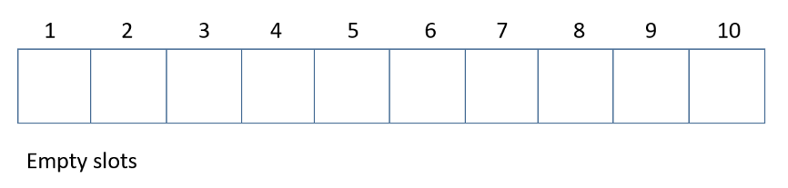
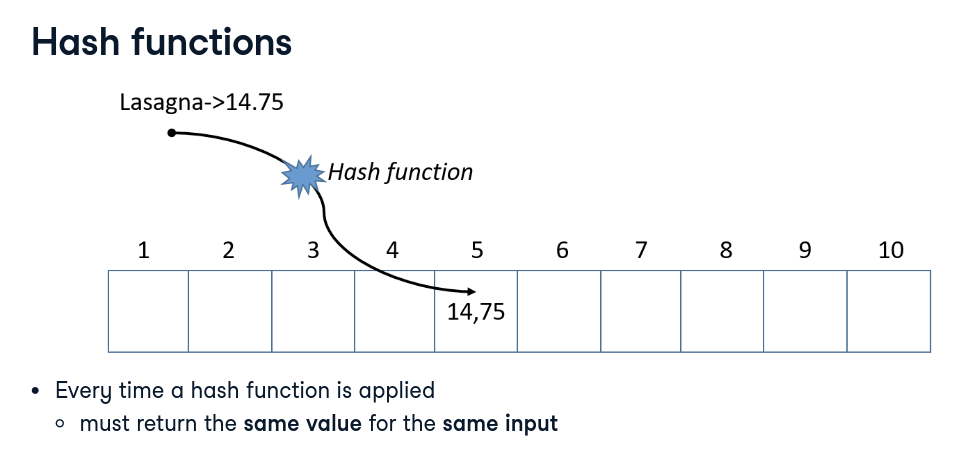
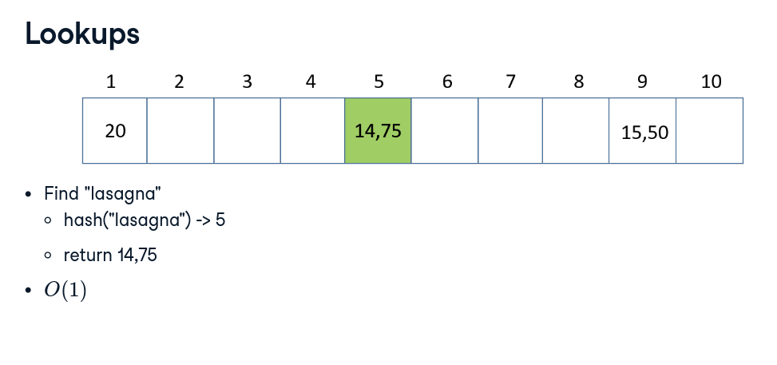
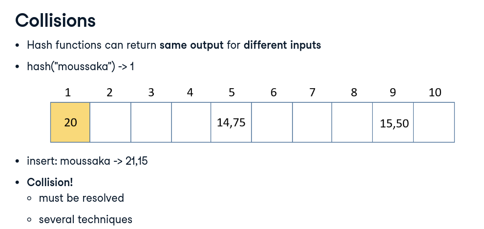

# Hash Table
- stores a collection of items
- **Key-value pairs**
  ```
  lasagna: 14.75
  spaghetti: 12.99
  sushi: 9.99
  ```
- almost every programming language has a built-in hash table:
  - hashes, hash maps, dictionaries, associative arrays
  - Python: **dictionaries**

## Hash Table Structure
- Each position: **slot/bucket**



**hash function**
- every time a hash function is applied:
  - must return the **same value** for the same input

**lookups**
- to find and get the value - O[1]


**collision**
- when the hash function returns the same value for multiple keys
  - must be resolved


## Python dictionary
- Empty dictionary
  ```python
  my_empty_dict = {}
  ```
- Dictionary with items
  ```python
  my_dict = {
    "lasagna": 14.75,
    "spaghetti": 12.99,
    "sushi": 9.99
  }
  ```

## Python dictionary get
```python
my_dict.get("lasagna")
```
- returns the value, buti returns `None` if the key is not in the dictionary

- to get all the key-value pairs, use `.items()`
```python
my_dict.items()
```
- to get all the keys, use `.keys()`
- to get all the values, use `.values()`

## Python dictionary - insert
```python
my_dict["lasagna"] = 14.75
```
## Python dictionary - modify/update
```python
print(my_dict.get("lasagna"))
my_dict["lasagna"] = 15.75
print(my_dict.get("lasagna"))
```
## Python dictionary remove
- delete a dictionary completely
```python
del my_dict
```

- remove a key-value pair
```python
del my_dict["lasagna"]
```

- empty a dictionary
```python
my_dict.clear()
```

## Python dictionary - loop
- loop through all the key-value pairs
```python
for key, value in my_dict.items():
  print(key, value)
```

- loop through all the keys
```python
for key in my_dict.keys():
  print(key)
```

- loop through all the values
```python
for value in my_dict.values():
  print(value)
```

## Python dictionary - nested dictionaries
- nested dictionaries
```python
nested_dict = {
  "lasagna": {
    "price": 14.75,
    "ingredients": {
      "noodles": 1,
      "sauce": 1,
      "meat": 1,
      "calories": 500
  },
  "sushi": {
    "price": 9.99,
    "ingredients": {
      "noodles": 1,
      "sauce": 1,
      "fish": 1,
      "calories": 300
        }
    },
    "spaghetti": {
      "price": 12.99,
      "ingredients": {
        "noodles": 1,
        "sauce": 1,
        "meat": 1,
        "calories": 500
        }
    }
  }
}