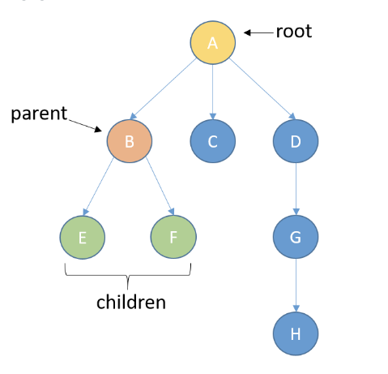
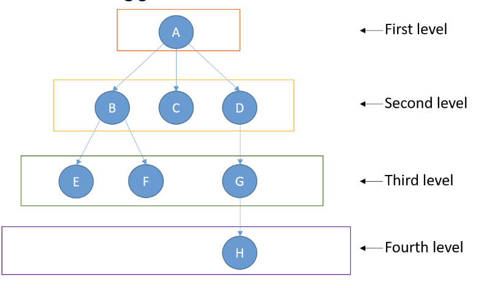

# Trees

## Definition
- A tree is a data structure composed of nodes - **node based data structure**
- each node can have links to one or more nodes
- the first node is called **the root**
- node can be a **parent** of other nodes, and these nodesd are called **children**


- trees have levels


## Tres - Binary Tree
- each node has:
  - zero children
  - one child
  - two children

```python
class TreeNode:
    def __init__(self, data, left=None, right=None):
        self.data = data
        self.left_child = left
        self.right_child = right

node1 = TreeNode('B')
node2 = TreeNode('C')
root_node = TreeNode('A', node1, node2)
```
## Trees - real uses
- Storing **hierarchical relationships**
  - File system of a computer
  - Structure of an HTML document
- **Chess**: possible moves of the rival
- **Seaching and sorting algorithms**


