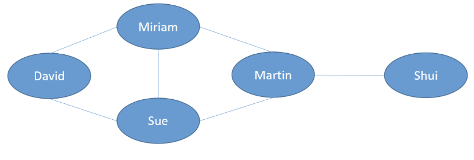
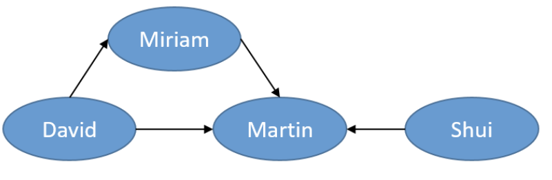
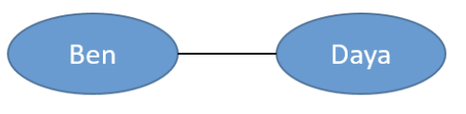
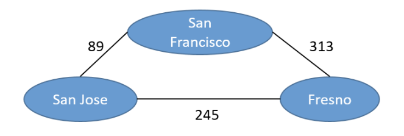

# Trees

## Definition
- A tree is a data structure composed of nodes - **node based data structure**
- each node can have links to one or more nodes
- the first node is called **the root**
- node can be a **parent** of other nodes, and these nodesd are called **children**


- trees have levels


## Tres - Binary Tree
- each node has:
  - zero children
  - one child
  - two children

## Trees - implementation

```python
class TreeNode:
    def __init__(self, data, left=None, right=None):
        self.data = data
        self.left_child = left
        self.right_child = right

node1 = TreeNode('B')
node2 = TreeNode('C')
root_node = TreeNode('A', node1, node2)
```
## Trees - real uses
- Storing **hierarchical relationships**
  - File system of a computer
  - Structure of an HTML document
- **Chess**: possible moves of the rival
- **Seaching and sorting algorithms**

# Graphs

## Definition
- A graph is a data structure composed of **nodes/vertices**
- nodes are connected by **links/edges**

- trees are a type of graph

## Graphs - types
- **Directed**:
  - Specific direction
  - The relationship is not mutual


- **Undirected**:
  - Edges have no direction
  - The relationship is mutual


- **Weighted Graph**
  - numeric values associated with the edges
  - can be either directed or undirected

_the following graph shows the distance betweem the cities_


## Graphs vs. trees

|Graphs|Trees|
|--|--|
|Cannot have cycles|Can have cycles|
|All nodes are connected|There can be unconnected nodes|

## Graphs - real uses
- User relationships in **social networks**
  - friendship
  - follows
  - likes
  - etc.
- **Locations and distances**
  - optimize routes
- **Graph databases**
- **Searching and sorting algorithms**

## Graphs - Implementation

```python
class Graph:
    def __init__(self):
        self.vertices = {}
    
    def add_vertex(self, vertex):
        self.vertices[vertex] = []
    
    def add_edge(self, source, target):
        self.vertices[source].append(target)

my_graph = Graph()
my_graph.add_vertex('David')
my_graph.add_vertex('Miriam')
my_graph.add_vertex('Martin')

my_graph.add_edge('David', 'Miriam')
my_graph.add_edge('David', 'Martin')
my_graph.add_edge('Miriam', 'Martin')
print(my_graph.vertices)
```
