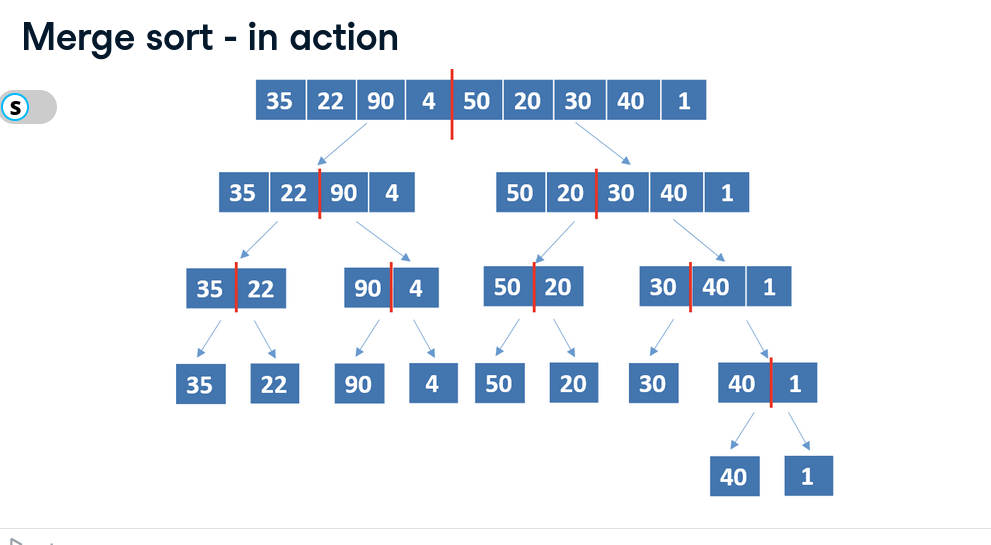

# Sorting Algorithms

## Merge Sort
- Follows **divide and conquer**
  - **Divide**
    - divides the problem into smaller sub-problems
  - **Conquer**
    - sub-problems are solved recursively
  - **Combine**
    - solutions of sub-problems are combined to achieve the final solution
  


## Implementation

```python
def merge_sort(my_list):
    if len(my_list) > 1:
        mid = len(my_list) // 2
        left_half = my_list[:mid]
        right_half = my_list[mid:]
        merge_sort(left_half)
        merge_sort(right_half)

        i = j = k = 0

        while i < len(left_half) and j < len(right_half):
            if left_half[i] < right_half[j]:
                my_list[k] = left_half[i]
                i += 1
            else:
                my_list[k] = right_half[j]
                j += 1
            k += 1

        while i < len(left_half):
            my_list[k] = left_half[i]
            i += 1
            k += 1

        while j < len(right_half):
            my_list[k] = right_half[j]
            j += 1
            k += 1
```

## Time Complexity

- **Worst Case**: $O(n \log(n))$
  - significant improvement over bubble sort, selection sort, and insertion sort
  - suitalbe for sortin large lists
- **Best Case**: $\Omega(n \log(n))$
  - other algorighsm (e.g. bubble sort, insertion sort) have better best case complexity
- **Average Case**: $\Theta(n \log(n))$
- Space complexity: $O(n)$
  - worst space complexity than other algorithms with $O(1)$
- Other variants reduce this space complexity

