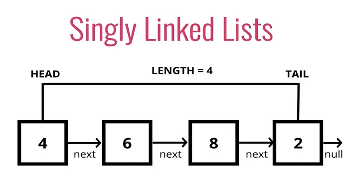

# Algorithms and data structures

## Intro

- **Algorithm**: A sequence of steps to solve a problem
- **Data structure**: A collection of data elements that can be stored and accessed
    - **Advanced** data structures: linked lists, stacks, queues, trees, graphs, ...

## Linked lists


[source](https://medium.com/@verdi/working-with-singly-linked-list-928c61ff841e)

- definition:
    sequence of data connected through links

- example:
    [https://en.wikipedia.org/wiki/Linked_list](https://en.wikipedia.org/wiki/Linked_list)

- structure:
    a. node
        1. data
        2. next - pointer to the next node
    b. head - first node
    c. tail - last node

- data doesn't need to be stored in contiguous block of memory
- data can be located in any available memory address

- types:
    - singly linked: only one link - one direction
    - doubly linked: two links - either directon
    - circular linked: loop in the list

- real uses:
    - can implement other data structures:
        - stacks
        - queues
        - graphs
    - access information by navigating backward and forward:
        - web browser
        - music playlist

- Node class

```python
class Node:
    def __init__(self, data):
        self.data = data
        self.next = None
```

- LinkedList class

```python
class LinkedList:
    def __init__(self):
        self.head = None
        self.tail = None
```

### Linked lists - methods

- insert_at_beginning()

```python
def insert_at_beginning(self, data):
    new_node = Node(data)
    if self.head:
        new_node.next = self.head
        self.head = new_node
    else:
        self.head = new_node
        self.tail = new_node
```

- remove_at_beginning()

- insert_at_end()

```python
def insert_at_end(self, data):
    new_node = Node(data)
    if self.head:
        self.tail.next = new_node
        self.tail = new_node
    else:
        self.head = new_node
        self.tail = new_node
```

- remove_at_end()

- insert_at_position()

- remove_at_position()

- search()
```python
def search(self, data):
    current_node = self.head
    while current_node:
        if current_node.data == data:
            return True
        else:
            current_node = current_node.next
    return False
```

- reverse()

- ...
