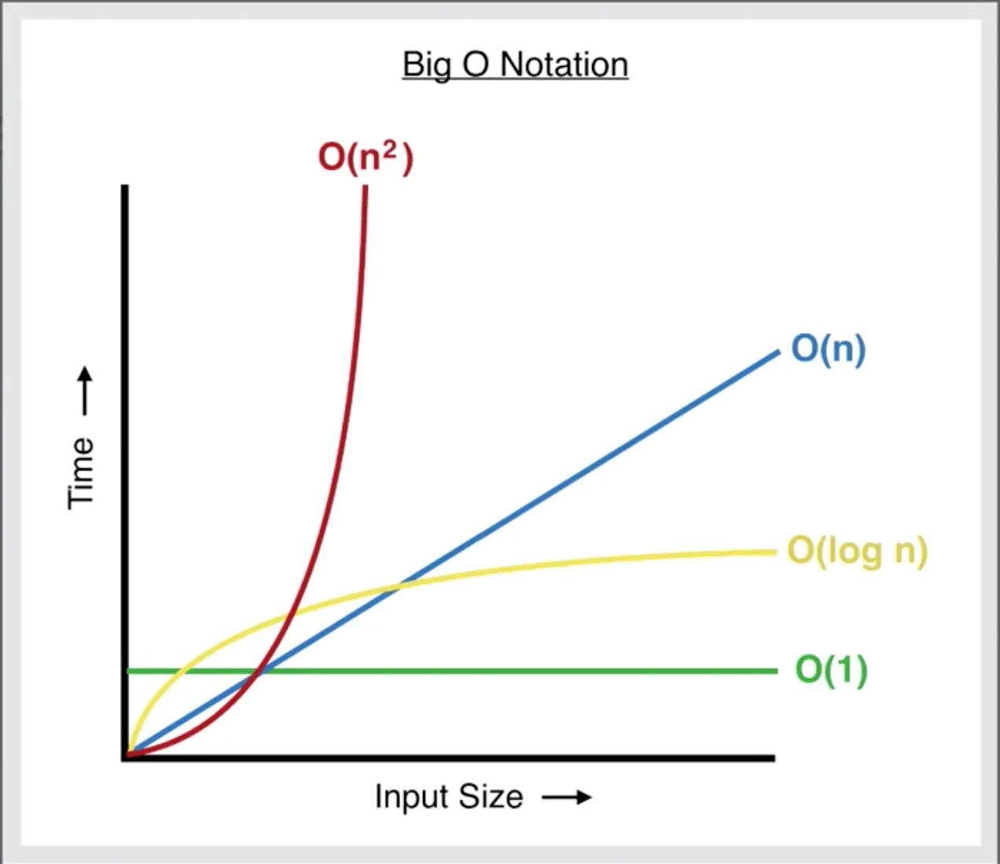

# Algorithms and data structures

## Intro

- **Algorithm**: A sequence of steps to solve a problem
- **Data structure**: A collection of data elements that can be stored and accessed
    - **Advanced** data structures: linked lists, stacks, queues, trees, graphs, ...

## Linked lists


[source](https://medium.com/@verdi/working-with-singly-linked-list-928c61ff841e)

- definition:
    sequence of data connected through links

- example:
    [https://en.wikipedia.org/wiki/Linked_list](https://en.wikipedia.org/wiki/Linked_list)

- structure:
    a. node
        1. data
        2. next - pointer to the next node
    b. head - first node
    c. tail - last node

- data doesn't need to be stored in contiguous block of memory
- data can be located in any available memory address

- types:
    - singly linked: only one link - one direction
    - doubly linked: two links - either directon
    - circular linked: loop in the list

- real uses:
    - can implement other data structures:
        - stacks
        - queues
        - graphs
    - access information by navigating backward and forward:
        - web browser
        - music playlist

- Node class

```python
class Node:
    def __init__(self, data):
        self.data = data
        self.next = None
```

- LinkedList class

```python
class LinkedList:
    def __init__(self):
        self.head = None
        self.tail = None
```

### Linked lists - methods

- insert_at_beginning()

```python
def insert_at_beginning(self, data):
    new_node = Node(data)
    if self.head:
        new_node.next = self.head
        self.head = new_node
    else:
        self.head = new_node
        self.tail = new_node
```

- remove_at_beginning()

- insert_at_end()

```python
def insert_at_end(self, data):
    new_node = Node(data)
    if self.head:
        self.tail.next = new_node
        self.tail = new_node
    else:
        self.head = new_node
        self.tail = new_node
```

- remove_at_end()

- insert_at_position()

- remove_at_position()

- search()
```python
def search(self, data):
    current_node = self.head
    while current_node:
        if current_node.data == data:
            return True
        else:
            current_node = current_node.next
    return False
```

- reverse()

- ...

## Understanding Big O Notation

- **Big O notation**: measures the worst-case complexity of an algorithm
    - *time complexity*: time taken to run completely
    - *space complexity*: amount of memory used
- doesn't use seconds/bytes - because different results depending on the hardware
- **Mathematical Expressions**: $O(1)$, $O(n)$, $O(n^2)$, ...


[resource](https://medium.com/dataseries/how-to-calculate-time-complexity-with-big-o-notation-9afe33aa4c46)

### Example $O(1)$ - Constant Time
```python
colors = ['green', 'blue', 'yellow', 'red', 'pink']

def constant(colors):
    print(colors[2])

constant(colors)
```

## Example $O(n)$ - Linear Time
```python

colors = ['green', 'blue', 'yellow', 'red', 'pink']

def linear(colors):
    for color in colors:
        print(color)

linear(colors)
```
- n=4: 4 operations
- n=5: 5 operations
- n=100: 100 operations
- ...

- complexity of the algorithm is $O(n)$

## Example $O(n^2)$ - Quadratic Time
```python
colors = ['green', 'blue', 'yellow', 'red', 'pink']

def quadratic(colors):
    for color1 in colors:
        for color2 in colors:
            print(color1, color2)


quadratic(colors)
```

- n=3: (3x3) 9 operations
- n=100: (100x100) 10,000 operations
- ...

- quadratic pattern
- complexity of the algorithm is $O(n^2)$


## Example $O(n^3)$ - Cubic Time
```python
colors = ['green', 'blue', 'yellow', 'red', 'pink']

def cubic(colors):
    for color1 in colors:
        for color2 in colors:
            for color3 in colors:
                print(color1, color2, color3)

cubic(colors)
```

- n=3: (3x3x3) 27 operations
- n=100: (100x100x100) 1,000,000 operations
- ...
- cubic pattern
- complexity of the algorithm is $O(n^3)$


### Calculating Big 0 Notation

```python
colors = ['green', 'blue', 'yellow', 'red', 'pink']  # O(1)
other_colors = ['orange', 'purple']  # O(1)

def complex_algorithm(colors):
    color_count = 0          # O(1)

    for color in colors:
        print(color)         # O(n)
        color_count += 1     # O(n)

    for color in other_colors:
        print(color)         # O(m)
        color_count += 1     # O(m)

    print(color_count)       # O(1)

complex_algorithm(colors)  # O(4 + 2n + 2m)
```

- **Rules**:
    1. Remove constants
        - $O(4 + 2n + 2m)$ $\to$ $O(n + m)$
    2. Different variables for different inputs
        - $O(n + m)$
    3. Remove smaller terms
        - $O(n + n^2)$ $\to$ $O(n^2)$

